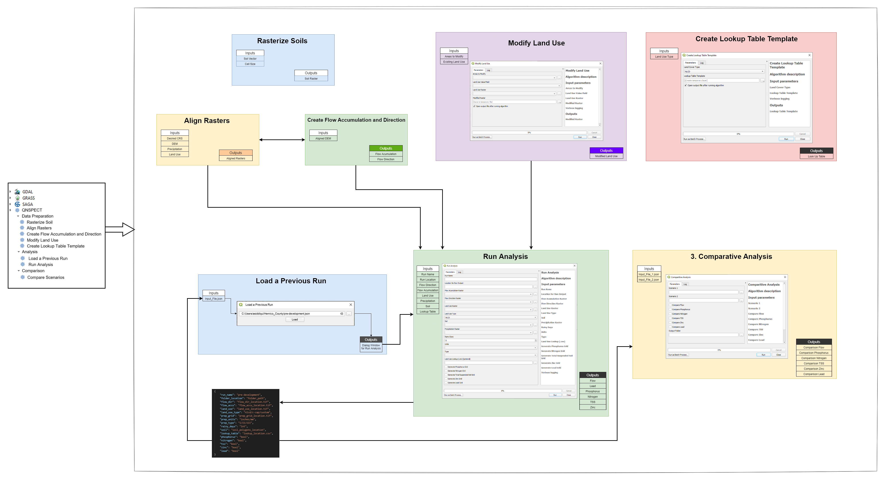

# QNSPECT

QNSPECT is the QGIS Plugin for NOAA Office of Coastal Management NSPECT (Nonpoint Source Pollution and Erosion Comparison Tool).

## About

QNSPECT is the QGIS implementation of NOAA Office for Coastal Management (OCM) Nonpoint-Source Pollution and Erosion Comparison Tool (NSPECT). NSPECT is a screening tool designed to allow users to estimate initial baseline pollution and erosion over an area and then compare how those values would change under a different land-use or management scenario.

## Installation

Once published, the QNSPECT will be available to install from official QGIS plugin repository.

Meanwhile, the plugin can be installed with the following steps:

1. Download repo to your computer
1. Copy the "inside" QNSPECT folder to your QGIS python plugins folder
1. Restart the QGIS to see the plugin

## Design

## Help
